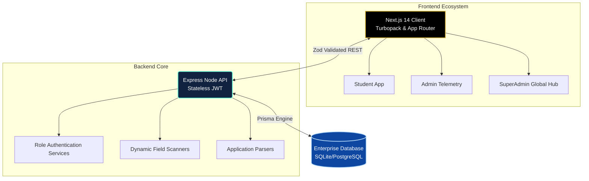

<div align="center">


<br/>

# 🪐 SASMS: The Future of Educational Management

**An Ultra-Modern, Next-Generation Ecosystem for Unrivaled Academic Intelligence & Administration.**

[](#)
[](#)
[](#)
[](#)
[](#)
[](#)
[](#)

<br/>

<p align="center">
  
</p>

</div>

---

## ⚡ What makes SASMS a Masterpiece?

Forget legacy systems. **SASMS (School Internal Operations Management System)** is engineered like a Fortune 500 platform—blazing fast, cryptographically secure, visually breathtaking, and infinitely scalable. It is the ultimate digital bridge between Students, Staff, and SuperAdmins.

*   💎 **Premium Corporate UI/UX:** Breathtaking design powered by perfectly calibrated Material UI tokens (Deep Navy & Imperial Gold). Every shadow, border, and animation feels expensive.
*   🚀 **Turbopack Powered Frontend:** Utilizing the absolute bleeding-edge of React & Next.js App Router for zero-latency page transitions.
*   🦾 **Armor-Clad Backend:** A bulletproof Node.js Express server mapped gracefully via Prisma ORM with impenetrable JWT Role-Based Access controls.
*   🧠 **Dynamic Intelligent Engineering:** Fields aren't hardcoded. SuperAdmins can forge multi-type relational schemas entirely via the UI that propagate globally in milliseconds.

---

## 🌌 Unrivaled Feature Matrix

### 🎓 The Student Metaverse `(Self-Service Hub)`
*   **The Smart Wallet:** Live tuition breakdowns, transparent payment histories, and API-ready digital gateways.
*   **Digital Identity Cards:** Real-time verifiable academic registries, schedules, and live absence trackers.
*   **The Command Pipeline:** Direct interactive hubs for complaints, ticketing, and administrative discourse tracking.
*   **Admission Telemetry:** Applicants track every micro-status update. Once approved, the system automatically morphs their account into a full Student profile seamlessly.

### 👑 The SuperAdmin Control Tower `(Administrative Dashboard)`
*   **Dynamic Intelligence Builder:** Add fields natively to admission forms (Text, Dropdowns, Required Files). The database expands dynamically with them.
*   **Algorithmic Leaderboards:** Filter, rank, and score applicants instantly using parsed Ministry, Exam, and Interview scores.
*   **Bulk Execution Engine:** Approve 1,000 applicants or mass-schedule 500 interviews simultaneously without stressing the CPU.
*   **The Native Viewer:** A built-in document scanner directly inside applicant draw maps allowing you to instantly assess uploads without downloading files.

---

## 🏗 The Architecture Diagram



---

## 🚀 Ignition Sequence (Getting Started)

Experience SASMS instantaneously. Our setup is engineered to be developer-friendly.

### ⚙️ Stage 1: The Core Backend
Boot up the engine that drives SASMS data.

```shell
cd backend

# 📦 Install architectural dependencies
npm install

# 🗄️ Forge the synchronized schema and generate types
npx prisma db push
npx prisma generate

# 🚀 Launch the local enterprise engine at Port 5001
npm run dev
```

### 🖥️ Stage 2: The Frontend Portal
Ignite the zero-latency user interface.

```shell
cd sasms-frontend

# 📦 Install UI/UX infrastructure
npm install

# 🌍 Clone the local environment mapping
cp .env.example .env.local

# ⚡ Ignite Turbopack Developer Server at Port 3000
npm run dev
```

---

## 🔐 The Key To The Kingdom
Upon initial hydration, launch into the SuperAdmin portal with these Master Credentials:

*   **Email:** `admin.super@sasms.edu`
*   **Passcode:** `123456`

---

## 🛡 Security & Compliance Oath
SASMS does not compromise. Every byte in transit is safeguarded:
- **Zero-Trust Access:** Frontend `RouteGuards` instantly sever connections to restricted modules if token privileges fail.
- **Mutant Defense Validation:** `Zod` rigidly inspects every incoming payload, dropping non-conforming parameters natively.
- **File Shielding:** Extracted custom documents are isolated dynamically, fully preventing XSS execution in administrative hubs.

<br/>

<div align="center">
  <h3>Built for those who demand nothing but the absolute best. Welcome to SASMS. 🌌</h3>
  
</div>
