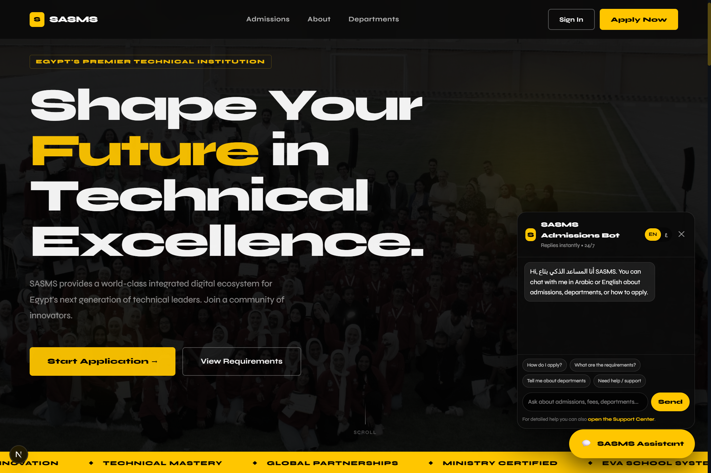
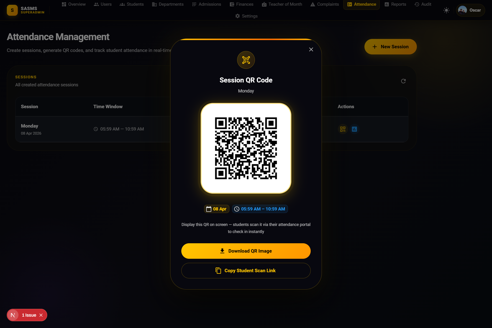

<div align="center">


<br/>

<p align="center">
  
</p>

<br/>

[](#)
[](#)
[](#)
[](#)
[](#)
[](#)
[](#)

</div>

---

## 🎨 About This Portal

> **EVA-SASMS Frontend** is not just a UI — it's a **precision-engineered visual empire** built to match the power of the backend engine it commands.

Every screen, shadow, token, and transition was architected with intention. The Deep Navy and Imperial Gold palette isn't aesthetic coincidence — it's a deliberate language of authority and clarity designed for high-stakes academic administration.

This portal serves **three completely sovereign user experiences** under one cohesive design system: a Student self-service hub, a Staff operations deck, and a SuperAdmin global control tower. All three powered by Next.js 14's App Router, turbocharged by Turbopack, and fortified by client-side route guards that terminate unauthorized sessions the instant a token fails.

---

## 📸 Screenshots

<div align="center">

<!-- 🖼️ Replace the src below with your actual screenshot paths or URLs -->
<!-- Recommended: Upload screenshots to your repo under /screenshots/ then link them here -->

| Home / Landing Page | Attendance System |
|:---:|:---:|
|  |  |
| *Main entry, overview & navigation* | *Track attendance, sessions & student presence* |

> 📌 **To add your screenshots:** Create a `screenshots/` folder in the repo root, drop your images in, and the table above will render automatically.

</div>

---

## 💎 Design System Foundations

### 🎨 Color Language

| Token | Hex | Role |
|-------|-----|------|
| `--navy-deep` | `#0a0a1a` | Primary background sovereign |
| `--navy-mid` | `#112240` | Card surfaces & containers |
| `--navy-light` | `#1a2a4a` | Hover states & elevated layers |
| `--gold-imperial` | `#D4AF37` | Primary accent — actions & highlights |
| `--gold-muted` | `#B8962E` | Secondary accent — borders & icons |
| `--text-primary` | `#E8E8F0` | Main legible content |
| `--text-secondary` | `#8892A4` | Metadata & secondary copy |
| `--success` | `#00C756` | Approval & positive states |
| `--danger` | `#FF4757` | Rejection & destructive actions |

### 📐 Typography Scale
- **Display / Headings** — `Playfair Display` (Imperial authority)
- **Body / UI Copy** — `JetBrains Mono` / `DM Sans` (Precision clarity)
- **Data / Tables** — `IBM Plex Mono` (Structured readability)

---

## 🌌 Portal Architecture — Three Sovereign Experiences

### 👤 The Student Hub `/student`
The self-service command center for enrolled students.

- **📊 Live Dashboard** — Real-time GPA tracker, attendance heatmap, and upcoming schedule at a glance
- **💳 Smart Wallet** — Itemized tuition breakdown, payment history timeline, and gateway-ready payment CTAs
- **🪪 Digital ID Card** — Verifiable academic registry with QR-linked identity, active course list, and semester status
- **🎫 Support Tickets** — Direct pipeline to administration: file complaints, track ticket status, receive admin responses
- **📡 Admission Tracker** — Live micro-status feed for applicants watching every stage of their application

### 🏛️ The SuperAdmin Control Tower `/admin`
The nerve center of the entire academic institution.

- **🧬 Intelligence Builder** — Add custom fields to admission forms (Text, Number, Dropdown, File) via UI; schema expands globally in real-time
- **📈 Applicant Leaderboard** — Filterable, sortable ranking table merging Ministry, Exam, and Interview scores with one-click admission
- **⚡ Bulk Execution Panel** — Mass-approve applicants, bulk-schedule interviews, and batch-assign staff in single atomic operations
- **🔍 Native Document Viewer** — Review applicant uploads without downloading a single file — built-in inline PDF & image scanner
- **📋 Analytics Telemetry** — Admission funnel metrics, acceptance ratios, and live headcount by department

### 👔 The Staff Deck `/staff`
Operational toolkit for faculty and administrative staff.

- **📅 Schedule Manager** — Drag-and-drop interview calendar with conflict detection and auto-notify
- **📝 Application Review Queue** — Structured review workflow with scoring panels and decision logging
- **💬 Communication Hub** — Respond to student tickets and complaints with SLA-aware prioritization

---

## 🏗️ Project Structure

```
EVA-SASMS-frontend/
│
├── 📁 app/                         # Next.js 14 App Router root
│   ├── 📁 (auth)/                  # Public routes — login, apply
│   ├── 📁 student/                 # Student portal pages
│   ├── 📁 admin/                   # SuperAdmin control tower
│   ├── 📁 staff/                   # Staff operations deck
│   ├── layout.tsx                  # Global layout + MUI theme provider
│   └── page.tsx                    # Landing page / role router
│
├── 📁 components/
│   ├── 📁 ui/                      # Atomic design system components
│   ├── 📁 charts/                  # Data visualization widgets
│   ├── 📁 forms/                   # Dynamic form builders
│   └── 📁 guards/                  # RouteGuard HOCs — token enforcement
│
├── 📁 lib/
│   ├── api.ts                      # Typed Axios API client
│   ├── auth.ts                     # JWT decode + role utilities
│   └── theme.ts                    # MUI theme: Deep Navy × Imperial Gold
│
├── 📁 hooks/                       # Custom React hooks (useAuth, useWallet...)
├── 📁 types/                       # Global TypeScript interfaces & enums
├── .env.example                    # Environment variables template
├── next.config.ts                  # Next.js config (Turbopack enabled)
└── tsconfig.json
```

---

## 🚀 Launch Sequence

### Prerequisites

| Tool | Min Version |
|------|-------------|
| Node.js | `v18+` |
| npm | `v9+` |
| EVA-SASMS Backend | Running on `localhost:5001` |

### ⚡ Cold Start

```bash
# Step 1 — Navigate into the portal
cd EVA-SASMS-frontend

# Step 2 — Install UI/UX infrastructure
npm install

# Step 3 — Configure environment
cp .env.example .env.local
# Then edit .env.local with your backend URL

# Step 4 — Ignite the Turbopack dev server 🚀
npm run dev
```

> Portal launches at **`http://localhost:3000`**

---

## 🔧 Environment Variables

Edit `.env.local` after copying from `.env.example`:

```env
# Backend API base URL
NEXT_PUBLIC_API_URL=http://localhost:5001/api

# App name displayed in UI
NEXT_PUBLIC_APP_NAME=SASMS

# Optional: Analytics / monitoring endpoint
NEXT_PUBLIC_ENV=development
```

---

## 🛡️ Client-Side Security Model

```
┌──────────────────────────────────────────────────────────┐
│              FRONTEND SECURITY ARCHITECTURE               │
├──────────────────────────────────────────────────────────┤
│  RouteGuard HOC  │ Validates JWT on every route mount    │
│  Role Resolver   │ Maps token role → permitted pages     │
│  Token Expiry    │ Auto-logout on expiration detection   │
│  XSS Shields     │ DOMPurify + Next.js CSP headers       │
│  API Interceptor │ Axios auto-injects auth header        │
└──────────────────────────────────────────────────────────┘
```

Every protected route is wrapped in a `<RouteGuard role="SUPER_ADMIN">` (or the relevant role). The moment a token signature fails or a role mismatch is detected, the user is **immediately redirected** to the login screen — no partial render, no data flash.

---

## 🧪 Development Commands

```bash
npm run dev          # Start Turbopack dev server (hot reload at localhost:3000)
npm run build        # Production build with Next.js optimization
npm run start        # Serve the production build locally
npm run lint         # ESLint + TypeScript strict type check
```

---

## 📸 Portal Visual Map

```
/                    → Auto-detect role → redirect to correct portal
/login               → Unified auth entry (role determined by backend)
/apply               → Public applicant form (dynamic fields rendered)

/student/dashboard   → Live metrics, schedule, wallet snapshot
/student/wallet      → Full payment history + tuition breakdown
/student/id          → Digital identity card with QR
/student/tickets     → Complaint & support ticket hub

/admin/dashboard     → Institution-wide telemetry
/admin/applicants    → Leaderboard + bulk actions + doc viewer
/admin/fields        → Dynamic field schema builder
/admin/interviews    → Schedule management
/admin/students      → Enrolled student management

/staff/queue         → Application review + scoring
/staff/schedule      → Interview calendar
/staff/tickets       → Student support responses
```

---

<div align="center">

**EVA-SASMS Frontend** — *Where data becomes experience. Where authority becomes design.*


</div>
